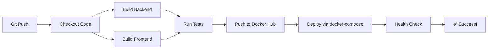

# 🚀 Jenkins Pipeline - Quick Reference

## 📁 Fichiers du Pipeline

| Fichier | Usage |
|---------|-------|
| `Jenkinsfile` | Pipeline complet (build → test → push → deploy) |
| `Jenkinsfile.minimal` | Version simple (build → deploy local uniquement) |
| `docker-compose.prod.yml` | Docker Compose pour production (utilise images Docker Hub) |
| `.env.jenkins` | Template variables d'environnement |
| `JENKINS_SETUP.md` | Guide complet de configuration |

---

## ⚡ Quick Start (3 minutes)

### 1. Configuration Jenkins (une seule fois)

```bash
# Sur le serveur Jenkins
sudo usermod -aG docker jenkins
sudo systemctl restart jenkins
```

Dans Jenkins Web UI:
1. **Credentials** → Ajouter `dockerhub-credentials` (rayandans + token)
2. **New Item** → Pipeline → Pointer vers `Jenkinsfile`
3. ✅ Done!

### 2. Préparer le serveur

```bash
# Copier .env.jenkins → .env et modifier les valeurs
cp .env.jenkins .env
nano .env  # Remplir AZURE_OPENAI_KEY, RESEND_API_KEY, etc.
```

### 3. Lancer le build

- Cliquez sur **Build Now** dans Jenkins
- Attendez ~5-10 minutes
- ✅ Application déployée sur http://localhost:8888 (backend) et http://localhost:3333 (frontend)

---

## 🎯 Commandes Utiles

### Vérifier l'état des conteneurs
```bash
docker ps --filter "name=guardianiq"
```

### Voir les logs
```bash
# Backend
docker logs guardianiq-backend-prod -f

# Frontend
docker logs guardianiq-frontend-prod -f

# Database
docker logs guardianiq-db-prod -f
```

### Redémarrer un service
```bash
docker-compose -f docker-compose.prod.yml restart backend
docker-compose -f docker-compose.prod.yml restart frontend
```

### Accéder au shell d'un conteneur
```bash
# Backend Django
docker exec -it guardianiq-backend-prod bash

# Frontend
docker exec -it guardianiq-frontend-prod sh

# Database
docker exec -it guardianiq-db-prod psql -U postgres -d guardianiq_db
```

### Migrations manuelles
```bash
docker exec guardianiq-backend-prod python manage.py migrate
docker exec guardianiq-backend-prod python manage.py makemigrations
```

### Créer un superuser
```bash
docker exec -it guardianiq-backend-prod python manage.py createsuperuser
```

### Nettoyer les images inutilisées
```bash
docker system prune -a
```

---

## 🔍 Troubleshooting

### ❌ Backend ne démarre pas

```bash
# Vérifier les logs
docker logs guardianiq-backend-prod

# Problèmes communs:
# 1. Database pas prête → Attendre 30s de plus
# 2. .env mal configuré → Vérifier les variables
# 3. Migrations non appliquées → docker exec ... python manage.py migrate
```

### ❌ Frontend ne charge pas

```bash
# Vérifier si le backend est accessible
curl http://localhost:8888/api/

# Vérifier les variables d'environnement
docker exec guardianiq-frontend-prod env | grep REACT_APP
```

### ❌ Database connection refused

```bash
# Vérifier que la DB tourne
docker ps | grep guardianiq-db-prod

# Tester la connexion
docker exec guardianiq-db-prod pg_isready -U postgres

# Si non, redémarrer
docker-compose -f docker-compose.prod.yml restart db
```

### ❌ Images pas trouvées sur Docker Hub

```bash
# Vérifier que les images existent
docker pull rayandans/guardianiq:backend-latest
docker pull rayandans/guardianiq:frontend-latest

# Si non, lancer le build dans Jenkins d'abord
```

---

## 📊 Workflow du Pipeline



### Détail des étapes

1. **Checkout** (10s) - Clone le repo
2. **Build Images** (3-5min) - Construit backend + frontend
3. **Tests** (1-2min) - Lance les tests Django
4. **Push Docker Hub** (2-3min) - Envoie les images
5. **Deploy** (1-2min) - Lance docker-compose.prod.yml
6. **Health Check** (30s) - Vérifie que tout tourne

**Durée totale:** ~8-12 minutes

---

## 🔐 Variables d'environnement requises

### ✅ Obligatoires

- `DJANGO_SECRET_KEY`
- `POSTGRES_PASSWORD`
- `AZURE_OPENAI_API_KEY`
- `RESEND_API_KEY`

### ⚠️ Optionnelles

- `GOOGLE_CLIENT_ID` / `GOOGLE_CLIENT_SECRET` (OAuth)
- `JWT_SECRET_KEY` (si vous utilisez JWT custom)

### 📝 Générer des secrets sécurisés

```bash
# Django Secret Key
python -c "from django.core.management.utils import get_random_secret_key; print(get_random_secret_key())"

# Postgres Password (32 caractères random)
openssl rand -base64 32

# JWT Secret
openssl rand -hex 32
```

---

## 🚀 Déployer sur un serveur distant

### Option 1: SSH depuis Jenkins

Ajouter dans le Jenkinsfile:

```groovy
stage('Deploy to Remote') {
    steps {
        sshagent(['ssh-credentials']) {
            sh """
                ssh user@remote-server '
                    cd /path/to/guardianiq &&
                    docker-compose -f docker-compose.prod.yml pull &&
                    docker-compose -f docker-compose.prod.yml up -d
                '
            """
        }
    }
}
```

### Option 2: Webhook

Sur le serveur distant, créer un webhook qui pull et redémarre:

```bash
# /opt/guardianiq/deploy.sh
#!/bin/bash
cd /path/to/guardianiq
docker-compose -f docker-compose.prod.yml pull
docker-compose -f docker-compose.prod.yml up -d
```

---

## 📈 Monitoring

### Health Check Endpoints

```bash
# Backend
curl http://localhost:8888/api/

# Frontend
curl http://localhost:3333/

# Database
docker exec guardianiq-db-prod pg_isready
```

### Prometheus Metrics (à implémenter)

```yaml
# docker-compose.prod.yml (à ajouter)
prometheus:
  image: prom/prometheus
  volumes:
    - ./prometheus.yml:/etc/prometheus/prometheus.yml
  ports:
    - "9090:9090"
```

---

## 🎯 Next Steps

Une fois le pipeline de base fonctionnel:

1. ✅ Ajouter **notifications Discord/Slack**
2. ✅ Implémenter **Trivy security scans**
3. ✅ Créer environnements **staging** et **production** séparés
4. ✅ Ajouter **rollback automatique** en cas d'échec
5. ✅ Implémenter **blue-green deployment**
6. ✅ Ajouter **tests E2E** avec Cypress

---

## 📞 Support

- 🐛 Issues: GitHub Issues
- 📚 Docs complètes: `JENKINS_SETUP.md`
- 💬 Questions: Créer une discussion

---

**Version:** 1.0
**Dernière mise à jour:** 2025-11-15
