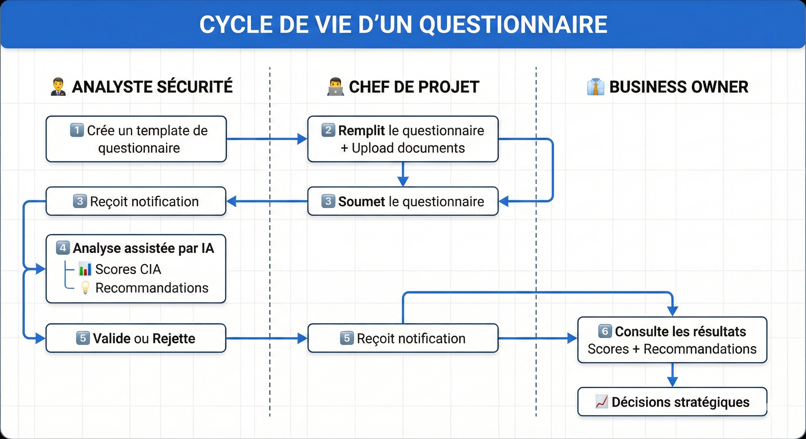
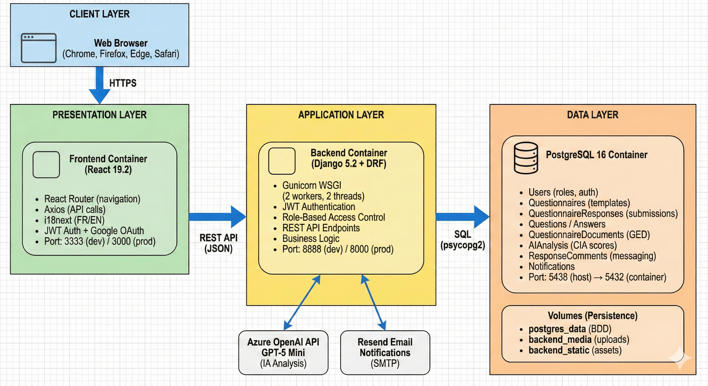
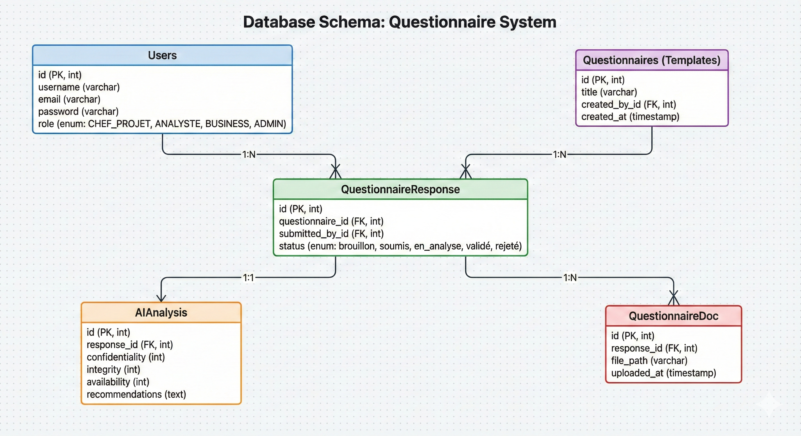
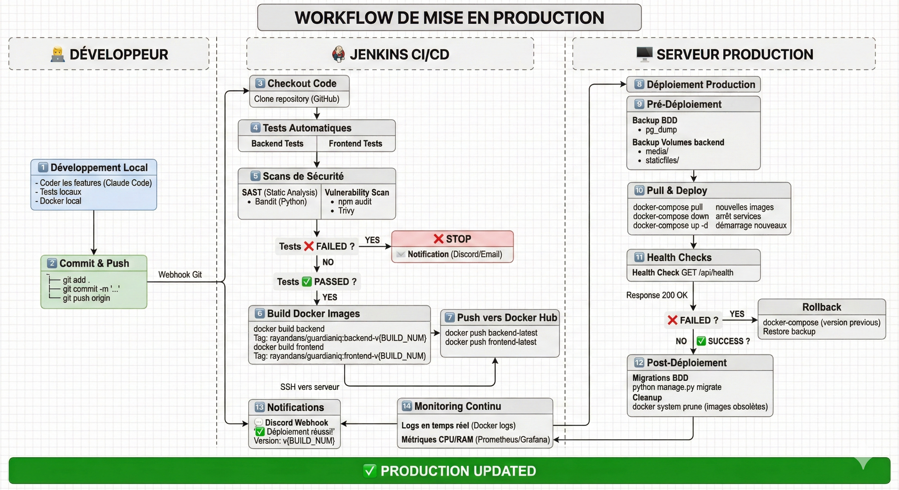
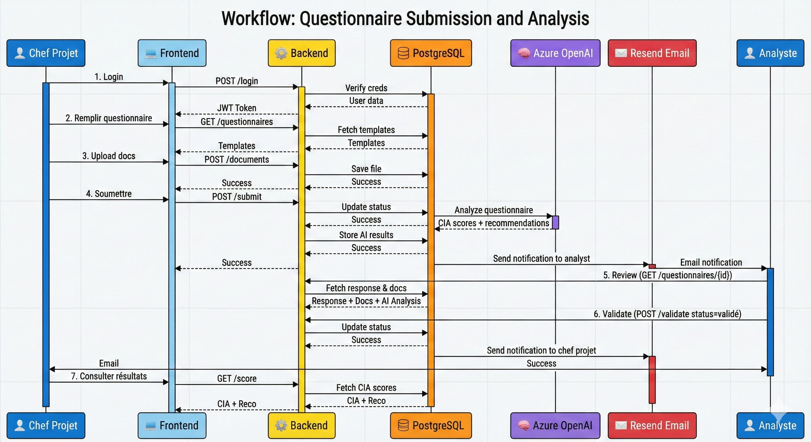

# 🛡️ GuardianIQ - Plateforme de Gestion de la Sécurité des Projets

<div align="center">

**Une solution intelligente pour évaluer, valider et optimiser la sécurité de vos projets IT**

[](https://www.python.org/)
[](https://www.djangoproject.com/)
[](https://reactjs.org/)
[](https://www.postgresql.org/)
[](https://www.docker.com/)
[](LICENSE)

[🚀 Démarrage Rapide](#-installation-et-démarrage) • [🏗️ Architecture](#%EF%B8%8F-architecture-technique) • [🔐 Sécurité](#-sécurité)

</div>

---

## 📋 Table des Matières

- [Contribution](#-Auteurs)
- [Introduction](#-introduction)
- [Pourquoi GuardianIQ ?](#-pourquoi-guardianiq-)
- [Fonctionnalités Principales](#-fonctionnalités-principales)
- [Comment ça fonctionne ?](#-comment-ça-fonctionne-)
- [Rôles et Permissions](#-rôles-et-permissions)
- [Architecture Technique](#%EF%B8%8F-architecture-technique)
- [Workflow Détaillé](#-workflow-détaillé)
- [API Documentation](#-api-documentation)
- [Installation et Démarrage](#-installation-et-démarrage)
- [Configuration](#%EF%B8%8F-configuration)
- [Déploiement](#-déploiement)
- [Sécurité](#-sécurité)

---

## 👨‍💻 Auteurs

- **Yeba Khwaou** - [@vyctoria21](https://github.com/vyctoria21)
- **Elodie Alexandre** - [@elodie-alexandre](https://github.com/elodie-alexandre)
- **Shainez Denfer** - [@takohtsubo](https://github.com/takohtsubo)
- **Bahdon Barkhad** - [@Filoutubes](https://github.com/Filoutubes)
- **Rayan Dansou** - [@RayanDansou](https://github.com/RayanDansou)

---


## 🎯 Introduction

**GuardianIQ** (anciennement SecApp) est une plateforme web complète conçue pour **automatiser et standardiser l'évaluation de la sécurité des projets IT**. Elle permet aux équipes de sécurité, chefs de projet et business owners de collaborer efficacement autour des enjeux de sécurité, en s'appuyant sur l'intelligence artificielle pour fournir des analyses et recommandations pertinentes.

### 🎭 Le Contexte

Dans le développement de projets IT, **la sécurité est souvent négligée ou traitée tardivement**. Les équipes de sécurité doivent examiner manuellement des dizaines de documents d'architecture, poser les mêmes questions répétitives, et perdre un temps précieux dans des allers-retours par email.

GuardianIQ transforme ce processus en :
- ✅ **Standardisant** l'évaluation via des questionnaires personnalisables
- 🤖 **Automatisant** l'analyse grâce à l'IA (Azure OpenAI)
- 📊 **Quantifiant** les risques avec des scores CIA (Confidentialité, Intégrité, Disponibilité)
- 💬 **Centralisant** la communication entre toutes les parties prenantes
- 📈 **Traçant** l'ensemble du processus de validation

---

## 💡 Pourquoi GuardianIQ ?

### Problèmes Résolus

| ❌ Avant | ✅ Avec GuardianIQ |
|---------|-------------------|
| Évaluations ad-hoc sans standard | Questionnaires standardisés et réutilisables |
| Analyse manuelle longue et fastidieuse | Analyse IA en quelques secondes |
| Échanges emails dispersés | Communication centralisée et tracée |
| Pas de scoring objectif | Scores CIA quantifiés et comparables |
| Documents perdus ou non consultés | GED intégrée avec accès sécurisé |
| Workflow flou | Processus clair avec statuts et notifications |

### Bénéfices Clés

🎯 **Pour les Analystes Sécurité**
- Gain de temps considérable (analyse IA)
- Templates réutilisables
- Historique complet des validations

📝 **Pour les Chefs de Projet**
- Process clair et guidé
- Feedback rapide et actionnable
- Visibilité sur l'état d'avancement

💼 **Pour les Business Owners**
- Vue consolidée des risques
- Scoring standardisé
- Traçabilité complète pour audit

---

## ⚡ Fonctionnalités Principales

### 🔐 Gestion des Utilisateurs
- Authentification sécurisée (JWT + Google OAuth 2.0)
- 4 rôles avec permissions granulaires
- Gestion des profils et photos

### 📝 Questionnaires de Sécurité
- **Création de templates** par les analystes
- **Remplissage progressif** avec sauvegarde brouillon
- **Questions personnalisables** selon les besoins
- **Historique complet** des modifications

### 📎 Gestion Documentaire (GED)
- Upload de documents d'architecture (PDF, Word, images)
- Stockage sécurisé et chiffré
- Validation des types MIME
- Consultation en ligne

### 🤖 Analyse IA Intelligente
- Intégration **Azure OpenAI** (GPT-5 Mini)
- Analyse automatique des réponses + documents
- Scoring **CIA** (Confidentialité, Intégrité, Disponibilité)
- Recommandations personnalisées

### ✅ Workflow de Validation
- Statuts clairs : Brouillon → Soumis → En analyse → Validé/Rejeté
- Notifications email automatiques (Resend API)
- Commentaires et retours structurés

### 💬 Communication Intégrée
- Système de messagerie par questionnaire
- Notifications en temps réel
- Traçabilité des échanges

### 📊 Exports et Rapports
- Export PDF (WeasyPrint)
- Export Word (python-docx)
- Rapports complets avec scores et recommandations

### 🌍 Multilingue
- Interface en Français et Anglais
- i18next pour l'internationalisation

---

## 🔄 Comment ça fonctionne ?

### Vue d'Ensemble du Processus



---

## 👥 Rôles et Permissions

### 🔵 Analyste Sécurité

**Responsabilités** :
- ✏️ Créer et gérer les templates de questionnaires
- 🔍 Analyser les questionnaires soumis
- ✅ Valider ou ❌ rejeter les questionnaires
- 💬 Fournir des recommandations et retours
- 📧 Recevoir des notifications automatiques

**Accès** :
- Dashboard analyste
- Liste des questionnaires en attente
- Détails complets (réponses + documents + IA)
- Outils de validation

---

### 🟢 Chef de Projet

**Responsabilités** :
- 📝 Remplir les questionnaires de sécurité
- 📎 Uploader les documents d'architecture
- 📊 Suivre l'état d'avancement (statuts)
- 💬 Échanger avec les analystes
- 📥 Recevoir les validations/rejets

**Accès** :
- Dashboard chef de projet
- Liste des questionnaires disponibles
- Formulaires de remplissage
- Upload de documents
- Messagerie intégrée

---

### 🟡 Business Owner

**Responsabilités** :
- 📈 Consulter les questionnaires validés
- 📊 Analyser les scores CIA
- 📖 Lire les recommandations de sécurité
- 💬 Envoyer des retours aux analystes
- 🎯 Prendre des décisions stratégiques

**Accès** :
- Dashboard business owner
- Vue consolidée des projets validés
- Détails des scores et recommandations
- Messagerie pour retours

---

### 🔴 Administrateur

**Responsabilités** :
- 👤 Gérer les utilisateurs (CRUD)
- 🔐 Attribuer les rôles
- ⚙️ Configurer la plateforme
- 📋 Accéder aux logs d'audit

**Accès** :
- Interface d'administration Django
- Gestion complète des utilisateurs
- Configuration système

---

## 🏗️ Architecture Technique

### Stack Technologique

<table>
<tr>
<td width="50%">

#### 🎨 Frontend
- **Framework** : React 19.2.0
- **Routing** : React Router 6.20
- **HTTP Client** : Axios
- **i18n** : i18next (FR/EN)
- **Auth** : JWT + Google OAuth 2.0
- **Icons** : Lucide React
- **Container** : Node 20 Alpine
- **Port** : 3333 (dev) / 3000 (prod)

</td>
<td width="50%">

#### ⚙️ Backend
- **Framework** : Django 5.2 + DRF
- **Langage** : Python 3.11
- **WSGI** : Gunicorn (2 workers)
- **Auth** : SimpleJWT + Google OAuth
- **CORS** : django-cors-headers
- **Container** : Python 3.11-slim
- **Port** : 8888 (dev) / 8000 (prod)

</td>
</tr>
<tr>
<td colspan="2">

#### 💾 Base de Données
- **SGBD** : PostgreSQL 16
- **Port** : 5438 → 5432
- **Optimisations** : Shared buffers 256MB, Max connections 30
- **Ressources** : 1GB RAM, 0.1 CPU (prod)

</td>
</tr>
<tr>
<td colspan="2">

#### 🌐 Services Externes
- **🤖 IA** : Azure OpenAI (GPT-5 Mini) - Analyse de sécurité et recommandations
- **📧 Email** : Resend API - Notifications automatiques
- **🔐 OAuth** : Google OAuth 2.0 - Authentification sociale

</td>
</tr>
</table>

---

### Architecture 3-Tiers



---

### Modèle de Données (Simplifié)



---

## 🔀 Workflow Détaillé

### Pipeline CI/CD Complet

Le processus de déploiement en production suit un workflow automatisé garantissant la qualité et la fiabilité du code déployé.



---

### Diagramme de Séquence - Processus Complet



---

## 📡 API Documentation

### Authentication Endpoints

| Method | Endpoint | Description | Auth Required |
|--------|----------|-------------|---------------|
| `POST` | `/api/auth/login/` | Connexion utilisateur (JWT) | ❌ |
| `POST` | `/api/auth/register/` | Inscription utilisateur | ❌ |
| `POST` | `/api/auth/logout/` | Déconnexion | ✅ |
| `POST` | `/api/auth/refresh/` | Rafraîchir le token JWT | ✅ |
| `GET` | `/api/auth/profile/` | Récupérer profil utilisateur | ✅ |
| `PUT` | `/api/auth/profile/` | Mettre à jour le profil | ✅ |
| `POST` | `/api/auth/change-password/` | Changer le mot de passe | ✅ |

---

### Questionnaires Endpoints

| Method | Endpoint | Description | Rôle Requis |
|--------|----------|-------------|-------------|
| `GET` | `/api/questionnaires/` | Liste des templates | Tous |
| `POST` | `/api/questionnaires/` | Créer un template | Analyste |
| `GET` | `/api/questionnaires/{id}/` | Détail d'un template | Tous |
| `POST` | `/api/questionnaires/{id}/responses/` | Créer une response | Chef Projet |
| `PUT` | `/api/questionnaires/{id}/responses/{response_id}/` | Mettre à jour (brouillon) | Chef Projet |
| `POST` | `/api/questionnaires/{id}/submit/` | Soumettre une response | Chef Projet |
| `POST` | `/api/questionnaires/{id}/validate/` | Valider/Rejeter | Analyste |
| `GET` | `/api/questionnaires/{id}/score/` | Récupérer scores CIA | Tous |


---

### Documents Endpoints

| Method | Endpoint | Description | Rôle Requis |
|--------|----------|-------------|-------------|
| `POST` | `/api/questionnaires/{id}/documents/` | Upload un document | Chef Projet |
| `GET` | `/api/questionnaires/{id}/documents/` | Liste des documents | Analyste, Business Owner |
| `GET` | `/api/questionnaires/{id}/documents/{doc_id}/` | Télécharger document | Analyste, Business Owner |
| `DELETE` | `/api/questionnaires/{id}/documents/{doc_id}/` | Supprimer document | Chef Projet |

---

### Messages Endpoints

| Method | Endpoint | Description | Rôle Requis |
|--------|----------|-------------|-------------|
| `GET` | `/api/questionnaires/{id}/messages/` | Liste des messages | Tous (concernés) |
| `POST` | `/api/questionnaires/{id}/messages/` | Envoyer un message | Tous (concernés) |

---

## 🚀 Installation et Démarrage

### Prérequis

- 🐳 **Docker** 20.10+ et **Docker Compose** 2.0+
- 🔑 **Clés API** :
  - Azure OpenAI (GPT-5 Mini)
  - Resend Email
  - Google OAuth Client ID (optionnel)

---

### Installation Locale (Développement)

#### 1️⃣ Cloner le Projet

```bash
git clone https://github.com/RayanDansou/SecApp.git
cd SecApp
```

#### 2️⃣ Configurer les Variables d'Environnement

```bash
# Copier le fichier exemple
cp .env.example .env

# Éditer le fichier .env avec vos clés
nano .env
```

**Variables essentielles** :

```env
# Django
DJANGO_SECRET_KEY=votre-cle-secrete-tres-longue-et-aleatoire
DEBUG=True
ALLOWED_HOSTS=localhost,127.0.0.1

# Database
DB_NAME=guardianiq_db
DB_USER=postgres
DB_PASSWORD=postgres
DB_HOST=db
DB_PORT=5432

# Azure OpenAI (REQUIS)
AZURE_OPENAI_KEY=sk-your-azure-openai-key
AZURE_OPENAI_ENDPOINT=https://your-endpoint.openai.azure.com/
AZURE_OPENAI_API_VERSION=2024-12-01-preview
AZURE_OPENAI_MODEL=gpt-5-mini

# Resend Email (REQUIS)
RESEND_API_KEY=re_your_resend_api_key
RESEND_FROM_EMAIL=noreply@guardianiq.com

# Google OAuth (Optionnel)
GOOGLE_CLIENT_ID=your-google-client-id.apps.googleusercontent.com
GOOGLE_CLIENT_SECRET=your-google-client-secret

# Frontend
FRONTEND_URL=http://localhost:3333
REACT_APP_API_URL=http://localhost:8888
```

#### 3️⃣ Lancer l'Application

```bash
# Construire et démarrer tous les services
docker-compose up --build

# Ou en arrière-plan
docker-compose up -d --build
```

#### 4️⃣ Accéder à l'Application

- 🌐 **Frontend** : [http://localhost:3333](http://localhost:3333)
- ⚙️ **Backend API** : [http://localhost:8888](http://localhost:8888)
- 🗄️ **PostgreSQL** : `localhost:5438`

#### 5️⃣ Créer un Superutilisateur (Admin)

```bash
# Accéder au container backend
docker exec -it secapp-backend bash

# Créer un admin Django
python manage.py createsuperuser

# Suivre les instructions (username, email, password)
```

#### 6️⃣ Accéder à l'Interface Admin Django

- 🔐 **Admin Panel** : [http://localhost:8888/admin](http://localhost:8888/admin)

---

### Scripts de Gestion

```bash
# Arrêter les services
docker-compose down

# Arrêter et supprimer les volumes (⚠️ perte de données)
docker-compose down -v

# Voir les logs en temps réel
docker-compose logs -f

# Reconstruire un service spécifique
docker-compose up -d --build backend

# Exécuter des commandes Django
docker exec -it secapp-backend python manage.py makemigrations
docker exec -it secapp-backend python manage.py migrate
docker exec -it secapp-backend python manage.py collectstatic
```

---

## ⚙️ Configuration

### Structure des Fichiers

```
SecApp/
├── backend/
│   ├── secapp/
│   │   ├── settings.py          # ⚙️ Configuration Django
│   │   └── urls.py              # 🔗 Routing principal
│   ├── users/                   # 👤 App utilisateurs
│   ├── questionnaires/          # 📝 App questionnaires
│   ├── requirements.txt         # 📦 Dépendances Python
│   └── Dockerfile
│
├── frontend/
│   ├── src/
│   │   ├── pages/               # 📄 Pages React
│   │   ├── components/          # 🧩 Composants réutilisables
│   │   ├── services/            # 🌐 API calls
│   │   ├── contexts/            # 📦 React Contexts
│   │   └── locales/             # 🌍 Traductions i18n
│   ├── package.json             # 📦 Dépendances Node
│   └── Dockerfile
│
├── docker-compose.yml           # 🐳 Configuration dev
├── docker-compose.prod.yml      # 🐳 Configuration production
├── .env.example                 # 📝 Template variables
├── Jenkinsfile                  # 🔧 Pipeline CI/CD
└── README.md                    # 📖 Ce fichier
```

---

### Configuration Avancée

#### Modifier les Ports

Éditer `docker-compose.yml` :

```yaml
services:
  frontend:
    ports:
      - "8080:3000"  # Changer 3333 → 8080

  backend:
    ports:
      - "9000:8000"  # Changer 8888 → 9000
```

#### Ajouter des Variables d'Environnement

Modifier `.env` puis redémarrer :

```bash
docker-compose down
docker-compose up -d
```

---

## 🌐 Déploiement

### Déploiement en Production

#### Option 1 : Docker Compose Production

```bash
# Utiliser la configuration optimisée
docker-compose -f docker-compose.prod.yml up -d

# Les images sont automatiquement tirées depuis Docker Hub
# rayandans/guardianiq:backend-latest
# rayandans/guardianiq:frontend-latest
```

**Optimisations production** :
- Gunicorn avec 2 workers, 2 threads
- Limites CPU/RAM configurées
- Health checks activés
- Volumes nommés pour persistance

#### Option 2 : Pipeline Jenkins (CI/CD)

Le projet inclut un **Jenkinsfile** complet qui automatise :

1. 🔍 **Checkout** du code
2. 📝 **Génération** des fichiers `.env`
3. 🏗️ **Build** des images Docker
4. 🧪 **Tests** unitaires (Django + React)
5. 🔒 **Scans** de sécurité
6. 📤 **Push** vers Docker Hub
7. 🚀 **Déploiement** automatique
8. 💬 **Notifications** Discord

**Configuration Jenkins** :
- Credentials Docker Hub : `guardianiqdockertoken`
- Webhook Discord configuré
- Build déclenché sur push Git

---

### Variables d'Environnement Production

```env
# Django
DEBUG=False
ALLOWED_HOSTS=guardianiq.cloud,api.guardianiq.cloud

# Database (PostgreSQL externe recommandé)
DB_HOST=production-db.example.com
DB_NAME=guardianiq_prod
DB_USER=guardianiq_user
DB_PASSWORD=STRONG_PASSWORD_HERE

# URLs
FRONTEND_URL=https://guardianiq.cloud
REACT_APP_API_URL=https://api.guardianiq.cloud

# Azure OpenAI
AZURE_OPENAI_KEY=your-production-key

# Resend Email
RESEND_FROM_EMAIL=noreply@guardianiq.cloud
```

---

## 🔐 Sécurité

### Mesures Implémentées

| Couche | Mesure | Description |
|--------|--------|-------------|
| 🔐 **Authentification** | JWT + OAuth 2.0 | Tokens sécurisés + Google OAuth |
| 🛡️ **Autorisation** | RBAC | 4 rôles avec permissions granulaires |
| 🔒 **Transport** | HTTPS | Chiffrement TLS en production |
| 💾 **Stockage** | Chiffrement | Secrets chiffrés, hashage bcrypt |
| 📎 **Uploads** | Validation | MIME types, taille max, antivirus |
| 🔍 **Audit** | Logs complets | Traçabilité de toutes les actions |
| 🐳 **Isolation** | Containers | Services isolés, réseau bridgé |
| ⚡ **Rate Limiting** | DRF Throttling | Protection contre brute force |
| 🧪 **Validation** | Input sanitization | Protection XSS, SQL injection |

---

### OWASP Top 10 Coverage

✅ **A01:2021 - Broken Access Control** → RBAC strict
✅ **A02:2021 - Cryptographic Failures** → JWT, HTTPS, hashage
✅ **A03:2021 - Injection** → ORM Django, validation inputs
✅ **A05:2021 - Security Misconfiguration** → Settings production
✅ **A07:2021 - Identification/Authentication Failures** → JWT + OAuth
✅ **A09:2021 - Security Logging Failures** → Audit logs complets

---

## 🙏 Remerciements

- Tous les contributeurs du projet

---

## 📞 Support

- 📧 **Email** : dansourayan@gmail.com
- 🐛 **Issues** : [GitHub Issues](https://github.com/RayanDansou/SecApp/issues)

---

<div align="center">

**⭐ Si ce projet vous est utile, n'hésitez pas à lui donner une étoile sur GitHub ! ⭐**

[🔝 Retour en haut](#%EF%B8%8F-guardianiq---plateforme-de-gestion-de-la-sécurité-des-projets)

---

*Fait avec ❤️ pour améliorer la sécurité des projets IT*

</div>


